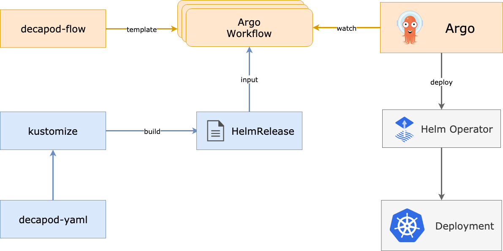

# decapod-flow

> Note: `DECAPOD (DEClarative APplication Orchestration & Delivery)` is a pilot project leveraging Kustomize, Helm Operator, Argo Workflow to deploy applications on Kubernetes. 

`decapod-flow` is an archive of Argo WorkflowTemplate.
It contains WorkflowTemplates and Workflow examples.



Purpose
-------
* Visibility of complex pipeline. i.e.) OpenStack deployment process
* Share useful WorkflowTemplates for devops or cicd.  

Prerequisite
------------
- Install [Argo](https://github.com/argoproj/argo) and `Argo CLI`
- Install [Helm Operator](https://github.com/fluxcd/helm-operator)


Usage
=============

### 1) Apply WorkflowTemplate
Create the workflow template using `Argo CLI`

> ```
> $ argo template create helmrelease-wftpl.yaml
> ```

then you can see the workflow template in a list if it's successfully submited.  
Also, you can check the workflow template in Argo UI.
> ```
> $ argo template list
> NAME
> helmrelease
> ```

### 2) Run Workflow with parameters
Copy site-values.yaml and update the values.
> ```
> $ argo submit openstack-infra-wf.tpl
> ```

